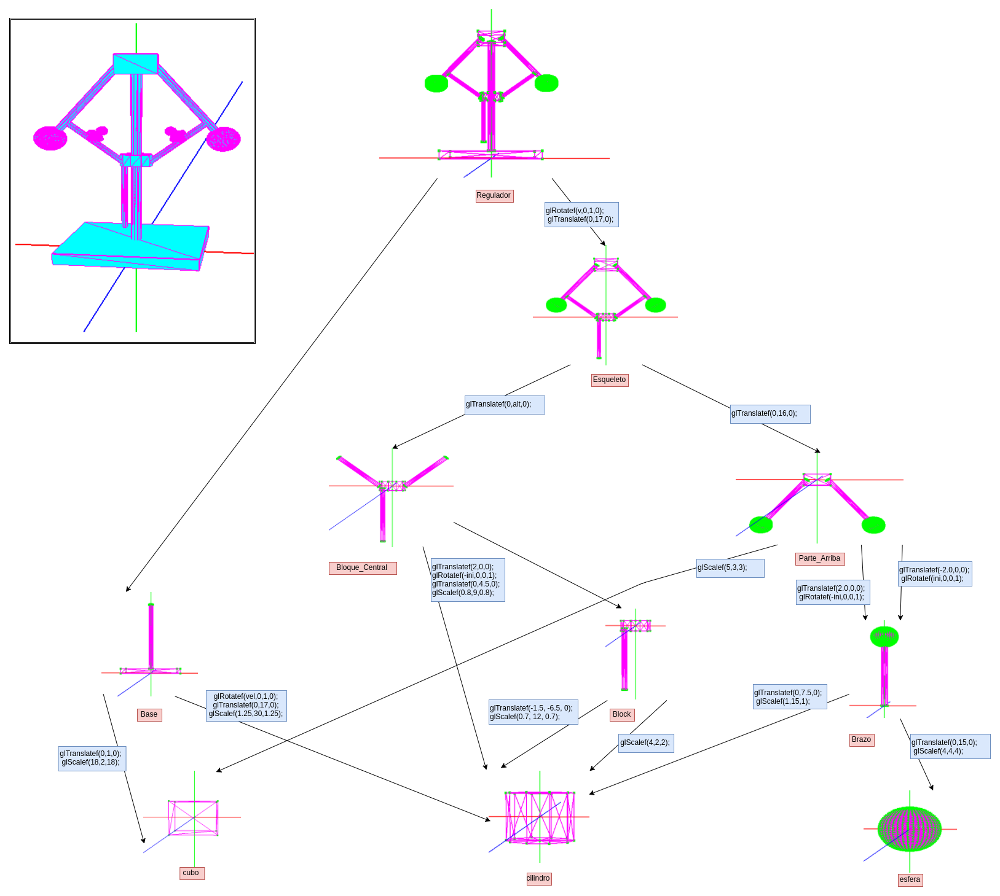

# Práctica 3 Informática Gráfica

## Teclas clave

### Normal Keys

void normal_keys(unsigned char Tecla1, int x, int y)
{

    switch (tecla)
    {
    case 'Q':
        exit(0);
        break;
    case 'P': //vertices
        vertice = !vertice;
        break;
    case 'L': //aristas
        arista = !arista;
        break;
    case 'S': //lados
        solid = !solid;
        chess = false;
        break;
    case 'A': //ajedrez
        chess = !chess;
        solid = false;
        break;
    case 'K':   
        rot -= inc;
        if (rot <= bajada_min)
            rot = bajada_min;
        inc_vel -= 0.3;
        if (inc_vel <= vel_min)
            inc_vel = vel_min;
        break;
    case 'k':
        rot += inc;
        if (rot >= subida_max)
            rot = subida_max;
        inc_vel += 0.3;
        if (inc_vel >= vel_max)
            inc_vel = vel_max;
        break;
    default:
        break;
    }

Las teclas 'K/k' se usan para mover una parte articulada que sube/baja sobre el eje central y aumentando y disminuyendo la velocidad de rotación del objeto.

### Teclas Especiales

    switch (Tecla1)
    {
    case GLUT_KEY_F1:
        figure = cubo;
        break; // Cubo
    case GLUT_KEY_F2:
        figure = tetraedro;
        break; // Tetraedro
    case GLUT_KEY_F3:
        figure = ply;
        break; //objeto ply
    case GLUT_KEY_F4:
        figure = revolucion;
        break;
    case GLUT_KEY_F5:
        figure = cilind;
        break;
    case GLUT_KEY_F6:
        figure = vas_inv;
        break;
    case GLUT_KEY_F7:
        figure = esfera;
        break;
    case GLUT_KEY_F8:
        figure = tube;
        break;
    case GLUT_KEY_F9:
        figure = vas;
        break;
    case GLUT_KEY_F10:
        figure = cone;
        break;
    case GLUT_KEY_F11:
        figure = bas;
        break;

Donde F11 es la tecla que muestra el objeto jerárquico con 3 grados de libertad que se ha construido para esta práctica

## Grafo Jerárquico

